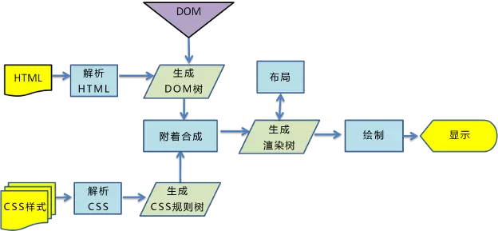

# css 和 js 的装载与执行

## html 页面加载渲染的过程

1. 解析 HTML 生成 DOM 树
2. 解析 CSS 生成 CSSOM 规则树
3. 将 DOM 树与 CSSOM 规则树合并在一起生成渲染树
4. 遍历渲染树开始布局，计算每个节点的位置大小信息
5. 将渲染树每个节点绘制到屏幕

## 加载和渲染过程的特点

- 顺序执行、并发加载（多个 css、js 文件可以并发加载，但是会顺序执行。并发度受域名限制，也就是一个域名只能并发加载一定数量的资源）
- 是否阻塞（css 加载是否阻塞 js 加载，css 加载是否阻塞 js 的执行，css 加载是否阻塞页面渲染，js 加载是否阻塞 后续 js 执行）
- 依赖关系（页面渲染是否有依赖关系，js 执行是否有依赖关系）
- 引入方式（css、js 的引入方式的特性）

## 顺序执行-并发加载

- 词法分析（词法分析是顺序执行）
- 并发加载
- 并发数量

## css 阻塞与 js 阻塞

- css header 中阻塞页面渲染（css 加载完后才会进行渲染）
- css 阻塞 js 执行（css 加载完之前，后续 js 的执行会被阻塞。js 执行可能需要依赖一些 css 的属性，所以需要被阻塞）
- css 不阻塞外部脚本的加载（阻塞执行，不阻塞加载）

- 直接引入的 js 阻塞页面的渲染（js 可能会操作 dom 或者修改文档结构，不可能一边操作 dom 一边渲染）
- js 不阻塞资源的加载（webkit 会预扫描资源，并且会预加载）
- js 顺序执行，阻塞后续 js 逻辑的执行

## 验证对于某个域名浏览器并发数是有上限的

## 验证css加载不会阻塞后面的 js 并发加载

## async、defter

## 动态异步引入js

## @import、link