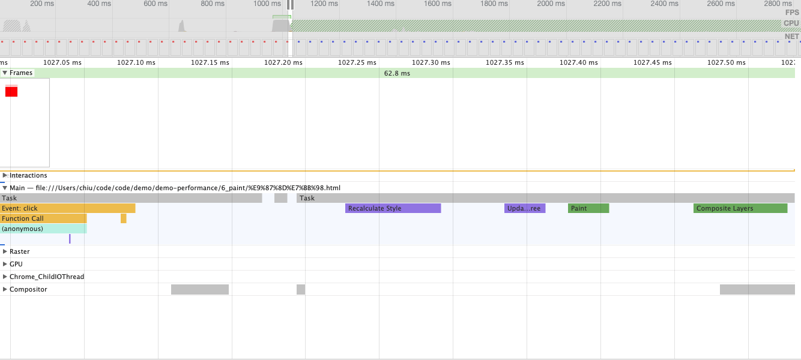
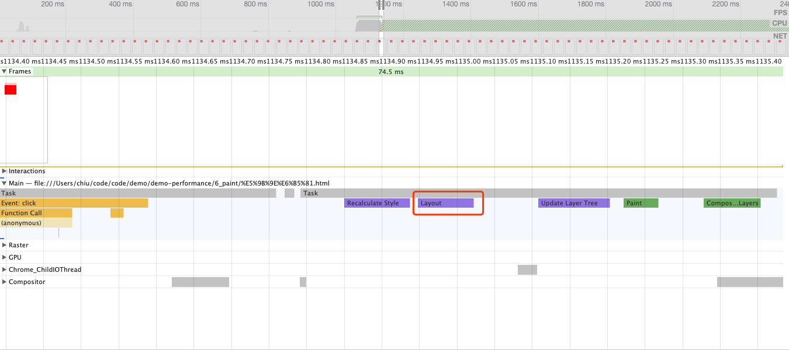

# 回流与重绘

## 1 css 会让 js 变慢

频繁触发重绘与回流，回导致 UI 频繁渲染，最终导致 js 变慢

## 2 回流和重绘的概念

### 2.1 回流

- 当 render tree 中的一部分（或全部）因为元素的规模尺寸、布局、隐藏等改变而需要重新构建。这就称为回流
- 当页面的布局和几何属性改变时，就需要回流

会触发回流的 css 属性：

- 盒子模型相关属性。width, height, padding, margin, display, border, min-height
- 定位属性和浮动。top, bottom, left, right, position, float, clear
- 改变节点内部文字结构。text-aligin, overflow, font-weight, font-family, line-height, vertival-aligin, font-size

### 2.2 重绘

- 当 render tree 中的一些元素需要更新属性，而这些属性只是影响元素的外观，风格，而不会影响布局的，比如 `background-color`。这就称为重绘

**回流一定会引起重绘，而重绘不一定会引起回流**

只触发重绘的 css 属性：

color, border-style, border-radius, visibility, text-decoration, background, background-image, background-position, background-repeat, background-size, outline-color, outline-style, box-shadow

## 3 新建 DOM 的过程

1. 获取 DOM 后分割为多个图层
2. 对每个图层的节点计算样式结果（recalculate style - 样式重计算）
3. 为每个节点生成图形和位置（layout - 回流和重布局）
4. 将每个节点绘制填充到图层位图中（paint - 重绘）
5. 图层作为纹理上传到 GPU
6. 合成多个图层到页面上生成最终屏幕图像（composite layers - 图层重组）

重绘和回流是以图层为单位的。

将频繁重绘回流的 DOM 元素单独作为一个独立图层，那么这个 DOM 元素的重绘和回流的影响只会在这个图层中。

但是图层并不是越多越好，图层的合成运算量是比较大的，如果图层太多的话就会在 composite layers 这里消耗大量的性能，这点也是需要极力避免的。

## 4 chrome 创建图层的条件

- 3D 或透视变换 CSS 属性（perspective transfrom）
- 使用加速视频解码的 video 节点 (浏览器会对 video 的每一帧进行重绘，所以能看到连续的视频)
- 拥有 3D (WebGl) 上下文或加速 2D 上下文的 canvas 节点
- 混合插件 (如 flash)
- 对自己的 opacity 做 CSS 动画或使用一个动画 webkit 变换的元素
- 拥有加速 CSS 过滤器的元素 (translate 3d)
- 元素拥有一个 z-index 较低且包含一个复合层的兄弟元素 (即有兄弟元素，有 z-index)

gif 图会持续的触发重绘，但是不会创建新的图层

## 5 优化思路

- 使用 translate 代替 top，top 会触发 layout 但 translate 不会
- 使用 opacity 代替 visibility，独立图层情况下，visibility 会触发重绘但是 opacity 不会
- 不要一条条修改 DOM 样式，预先定义好 class 然后修改 DOM 的 className，因为每修改一条样式都会触发重绘
- 把 DOM 离线后修改，display: none，后续修改都不会重绘
- 不要把 DOM 的属性值放在循环里，当成循环的变量。比如获取 offsetHeight 时，会触发回流。因为需要刷新缓冲区域，去获取真实的值
- 不要使用 table 布局，可能一个小改动会造成整个 table 的重新布局
- 动画实现速度的选择，UI 线程和 js 线程是相互阻塞的，css 动画会影响 js 运行
- 动画区域使用新图层
- 启动 GPU 硬件加速

## 6 performance 工具

[https://juejin.im/post/5b65105f5188251b134e9778](https://juejin.im/post/5b65105f5188251b134e9778)

[https://developers.google.com/web/tools/chrome-devtools/evaluate-performance](https://developers.google.com/web/tools/chrome-devtools/evaluate-performance)

下面搬运一点这篇文章的内容：

跟页面性能挂勾比较深的几个维度是：网络链路、服务器资源、前端渲染效率、客户端硬件

这几个维度不是互不相关的，反而是犬牙交错的关系。例如渲染过程中浏览器反应很慢，有可能是脚本写得太烂遭遇性能瓶颈，也有可能是应用开太多或者正在打游戏占用了过多计算机资源

Performance 工具的侧重点则在于前端渲染过程，它拥有帧率条形图、CPU 使用率面积图、资源瀑布图、主线程火焰图、事件总揽等模块，它们和渲染息息相关，善用它们可以清晰地观察整个渲染阶段

**控制面板选项：**

- Network 限制网速
- CPU 限制 CPU 资源
- Disable JavaScript samples 使工具忽略记录 JS 的调用栈
- Enable advanced paint instrumentation 详细记录某些渲染事件的细节

**CPU 面积图：**

- 蓝色：加载（Loading）事件
- 黄色：脚本运算（Scripting）事件
- 紫色：渲染（Rendering）事件
- 绿色：绘制（Painting）事件
- 灰色：其他（Other）
- 闲置：浏览器空闲

**Frames：**

帧线程，可以看到每一次渲染的页面，鼠标悬浮绿色块可以看到 fps

**渲染事件：**

- Parse HTML 解析 HTML
- Evaluate Script 执行 JavaScript
- Recalculate style 计算样式
- Layout 计算每个节点在屏幕中的精确位置和大小
- Update Layer Tree
- Paint 绘制到图层
- Composite Layers 渲染引擎合成图层最终人眼可见

## 7 rendering 工具

- Paint flashing 高亮重绘区域
- Layout Shift Regions 高亮移动的区域
- Layer borders 显示图层组合边界
- FPS meter 显示帧率
- Scrolling performance issues 高亮显示影响滚动的元素
- Highlight ad frames
- Hit-test borders

## 8 实例

### 8.1 回流和重绘

```javascript
// 改变元素的 left 值
box1.addEventListener('click', () => {
  box1.style.left = '100px';
});

// 改变元素的背景颜色
box1.addEventListener('click', () => {
  box1.style.backgroundColor = '#00f';
});
```


(重绘)


(回流)

- 重绘，触发重绘的属性
- 回流，触发回流的属性
- 图层，创建图层的条件
- 图层过多情况
- renderer 工具
