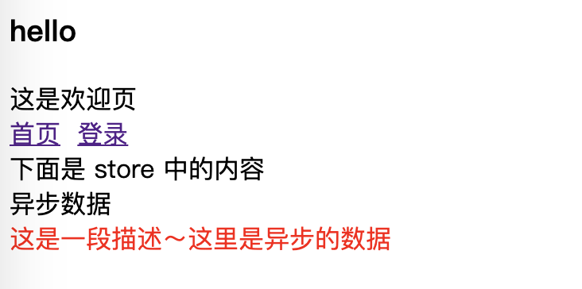
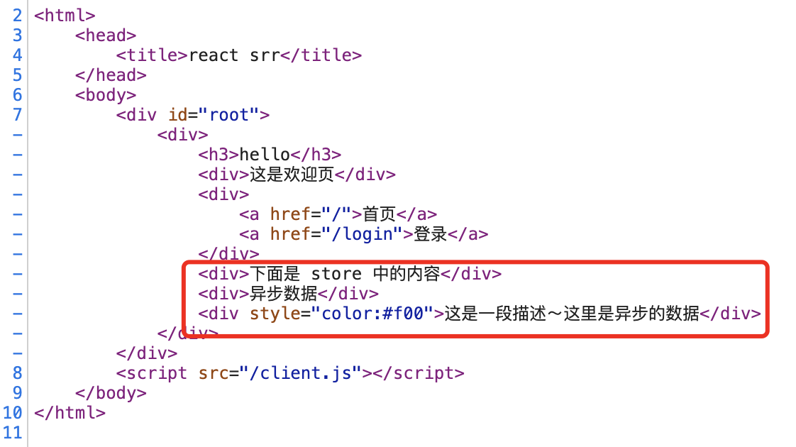

# 在 SSR 中使用 redux

demo 地址 [https://github.com/wawjqyh/demo-react-ssr/tree/master/6-async-data](https://github.com/wawjqyh/demo-react-ssr/tree/master/6-async-data)

首先抛出几个问题：

1. 服务端如何使用 redux，如何构建代码
2. 服务端如何拿到异步的数据
3. 如何做同构

## 1 写一个简单的 redux

下面的代码注册了一个 user model，提供一个返回 store 实例的方法。

> 注意这里不能像常规的客户端渲染那样直接返回实例，因为返回的是一个单例，确保服务端每次渲染都能拿到一个新的实例

```javascript
const userInitialState = {
  name: 'redux',
  desc: '这个是服务端使用 redux 的 demo'
};

const userReducer = (state, action) => {
  if (typeof state === 'undefined') state = initialState;

  switch (action.type) {
    case 'user/save': {
      return { ...state, ...action.payload };
    }
    default:
      return state;
  }
};

// 服务端不能直接返回 createStore，这是一个单例
export function getStore() {
  return createStore(combineReducers({ user: userReducer }, { user: userInitialState }));
}
```

在一个组件中显示 redux 中的数据（组件中有一个异步获取数据的方法，获取数据后更新 redux）：

```javascript
class Hello extends Component {
  async componentDidMount() {
    // 异步获取数据，然后更新 redux 中的数据
    const res = await getUserInfo();
    this.props.dispatch({
      type: 'user/save',
      payload: res
    });
  }

  render() {
    return (
      <div>
        <div>下面是 store 中的内容</div>
        <div>{this.props.user.name}</div>
        <div style={{ color: '#f00' }}>{this.props.user.desc}</div>
      </div>
    );
  }
}

export default connect(state => ({
  user: state.user
}))(Hello);
```

## 2 使用 redux

### 2.1 SCR 中使用

使用 Provider 组件包裹需要使用 redux 的组件。

下面是关键代码：

```javascript
ReactDOM.hydrate(
  <Provider store={getStore()}>
    <BrowserRouter>
      <RouterIndex />
    </BrowserRouter>
  </Provider>,
  appTarget
);
```

### 2.2 SSR 中使用

同样是使用 Provider 组件～

```javascript
router.get('*', (ctx, next) => {
  const content = renderToString(
    <Provider store={getStore()}>
      <StaticRouter location={ctx.request.url} context={{}}>
        <RouterIndex />
      </StaticRouter>
    </Provider>
  );

  ctx.body = `
    <html>
      <head>
        <title>react srr</title>
      </head>
      <body>
        <div id="root">${content}</div>
        <script src="/client.js"></script>
      </body>
    </html>
  `;
});
```

## 3 运行效果




上面的例子中，数据获取是在客户端完成的，服务端并未获取数据。

服务端渲染渲染出了 redux 中的数据，但是只能拿到 initialState 中的数据，组件中的异步数据无法被渲染。

组件是在 componentDidMount 钩子中去获取异步数据的，但是服务端渲染不会进入这个生命周期，所以异步数据无法被获取。

那么服务端需要获取数据的话，异步方法就应该另外处理。

## 4 在服务端获取异步数据

关于服务端渲染获取数据，react-router-dom 文档中提供了相关的方法。

[https://reacttraining.com/react-router/web/guides/server-rendering](https://reacttraining.com/react-router/web/guides/server-rendering)

解决方案就是，需要获取数据的组件需要提供一个 loadData 的静态方法，loadData 方法是提供给服务端调用的，这个方法负责在服务器渲染之前，把这个路由需要的数据提前加载好。

而需要调用哪些 loadData 的方法，需要根据当前用户的请求地址去匹配。比如访问的是 `/login` 路径，就去拿 Login 组件的数据。所以路由的配置需要用另一种方式写。

当然不局限于一种方法，主要目的就是让服务端能够知道需要去获取哪些数据，并且提供获取数据的方法。

### 4.1 loadData 方法

需要服务端获取数据的组件需要提供一个 loadData 的静态方法

```javascript
// 这个方法用于服务端加载该页面的数据
Hello.loadData = async store => {
  const res = await getUserInfo();
  store.dispatch({
    type: 'user/save',
    payload: res
  });
};
```

### 4.2 路由的配置

将每个路由的 loadData 方法写在配置文件中，改为配置式路由：

```javascript
export default [
  {
    path: '/',
    exact: true,
    component: Index,
    key: 'index'
  },
  {
    path: '/login',
    exact: true,
    component: Login,
    key: 'login'
  },
  {
    path: '/hello',
    exact: true,
    component: Hello,
    loadData: Hello.loadData, // 组件获取数据的方法
    key: 'hello'
  }
];
```

### 4.3 服务端获取数据

服务端使用一个工具 [react-router-config](https://github.com/ReactTraining/react-router/tree/master/packages/react-router-config)

这个工具能够根据当前的页面地址，在路由的配置中找到当前匹配的路由。

```javascript
import { matchRoutes } from 'react-router-config';
import { getStore } from '../src/store';

export default async function(url) {
  const store = getStore();
  const matched = matchRoutes(routes, url); // 匹配当前路由
  const loadDatas = []; // 加载数据

  matched.forEach(item => {
    if (item.route.loadData) loadDatas.push(item.route.loadData(store));
  });

  // 执行所有匹配到的 loadData 方法
  if (loadDatas.length) await Promise.all(loadDatas);

  const content = renderToString(
    <Provider store={store}>
      <StaticRouter location={url} context={{}}>
        {routes.map(route => (
          <Route {...route} key={route.key} />
        ))}
      </StaticRouter>
    </Provider>
  );

  return content;
}
```

### 4.4 运行效果

Hello 组件中 loadData 方法调用了 getUserInfo，这个方法延迟 1.5s 返回如下数据：

```javascript
export async function getUserInfo() {
  await delay(1500);
  return {
    name: '异步数据',
    desc: '这是一段描述～这里是异步的数据'
  };
}
```

在浏览器中查看源代码，服务端渲染的页面中的数据是 loadData 中返回的数据，说明服务端获取数据成功了：



查看网络请求，可以看到当前页面的请求耗时 1.51s，服务端需要等待 loadData 执行完成，拿到数据后再渲染 react 组件，饭后返回给浏览器


