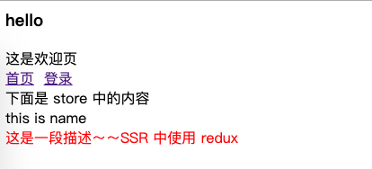
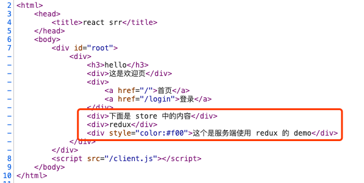

# 在 SSR 中使用 redux

demo 地址

首先抛出几个问题：

1. 服务端如何使用 redux，如何构建代码
2. 服务端如何拿到异步的数据
3. 如何做同构

## 1 写一个简单的 redux

下面的代码注册了一个 user model，提供一个返回 store 实例的方法。

> 注意这里不能像常规的客户端渲染那样直接返回实例，因为返回的是一个单例，确保服务端每次渲染都能拿到一个新的实例

```javascript
const userInitialState = {
  name: 'redux',
  desc: '这个是服务端使用 redux 的 demo'
};

const userReducer = (state, action) => {
  if (typeof state === 'undefined') state = initialState;

  switch (action.type) {
    case 'user/save': {
      return { ...state, ...action.payload };
    }
    default:
      return state;
  }
};

// 服务端不能直接返回 createStore，这是一个单例
export function getStore() {
  return createStore(combineReducers({ user: userReducer }, { user: userInitialState }));
}
```

在一个组件中显示 redux 中的数据（组件中有一个异步获取数据的方法，获取数据后更新 redux）：

```javascript
class Hello extends Component {
  async componentDidMount() {
    // 异步获取数据，然后更新 redux 中的数据
    const res = await getUserInfo();
    this.props.dispatch({
      type: 'user/save',
      payload: res
    });
  }

  render() {
    return (
      <div>
        <div>下面是 store 中的内容</div>
        <div>{this.props.user.name}</div>
        <div style={{ color: '#f00' }}>{this.props.user.desc}</div>
      </div>
    );
  }
}

export default connect(state => ({
  user: state.user
}))(Hello);
```

## 2 使用 redux

### 2.1 SCR 中使用

使用 Provider 组件包裹需要使用 redux 的组件。

下面是关键代码：

```javascript
ReactDOM.hydrate(
  <Provider store={getStore()}>
    <BrowserRouter>
      <RouterIndex />
    </BrowserRouter>
  </Provider>,
  appTarget
);
```

### 2.2 SSR 中使用

同样是使用 Provider 组件～

```javascript
router.get('*', (ctx, next) => {
  const content = renderToString(
    <Provider store={getStore()}>
      <StaticRouter location={ctx.request.url} context={{}}>
        <RouterIndex />
      </StaticRouter>
    </Provider>
  );

  ctx.body = `
    <html>
      <head>
        <title>react srr</title>
      </head>
      <body>
        <div id="root">${content}</div>
        <script src="/client.js"></script>
      </body>
    </html>
  `;
});
```

## 3 运行效果





服务端渲染渲染出了 redux 中的数据，但是只能拿到 initialState 中的数据，组件中的异步数据无法被渲染。

## 4 在服务端获取异步数据
